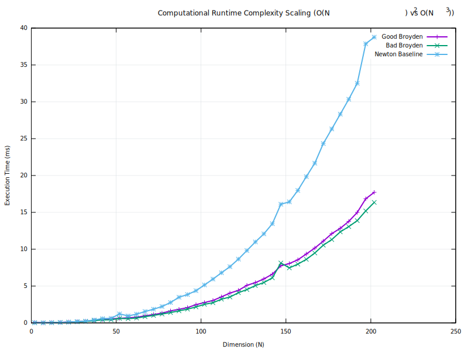
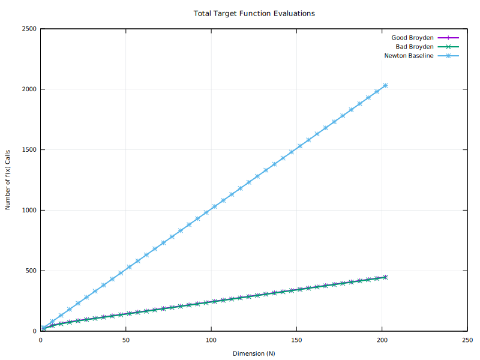
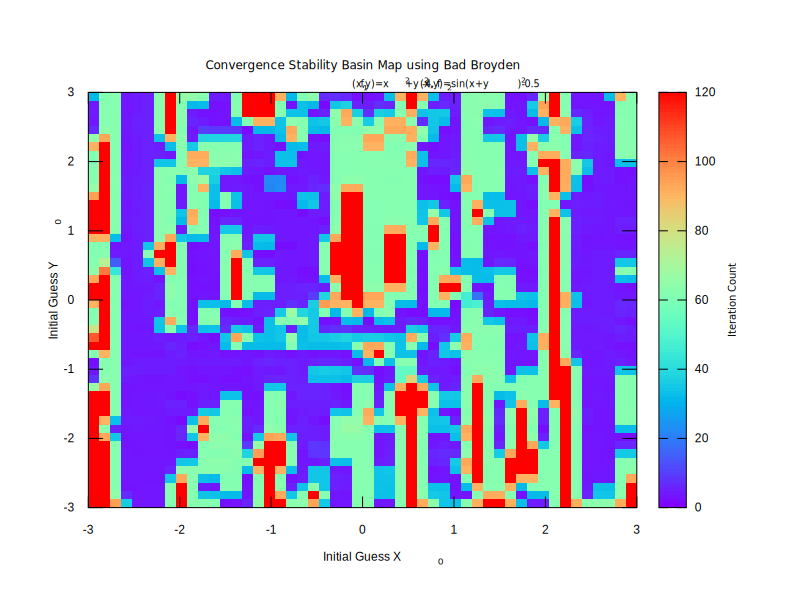
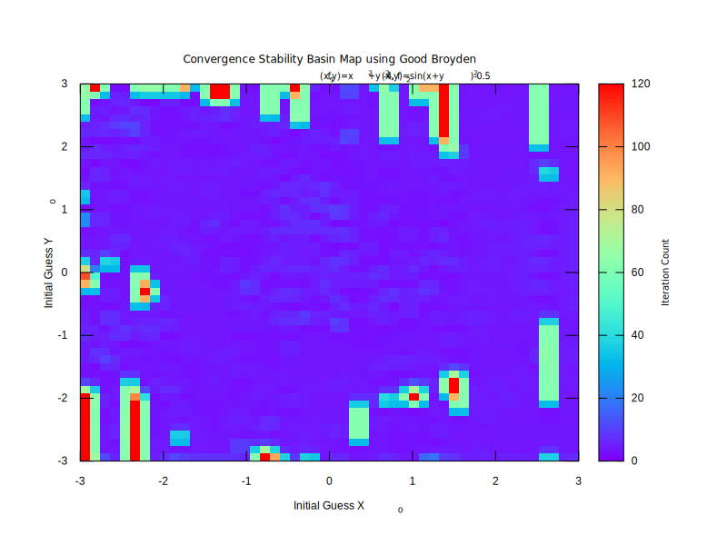
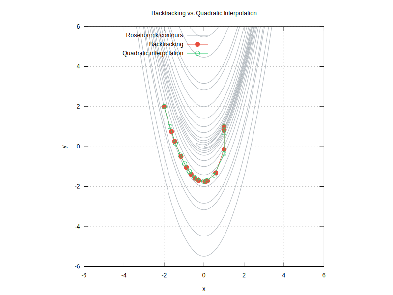
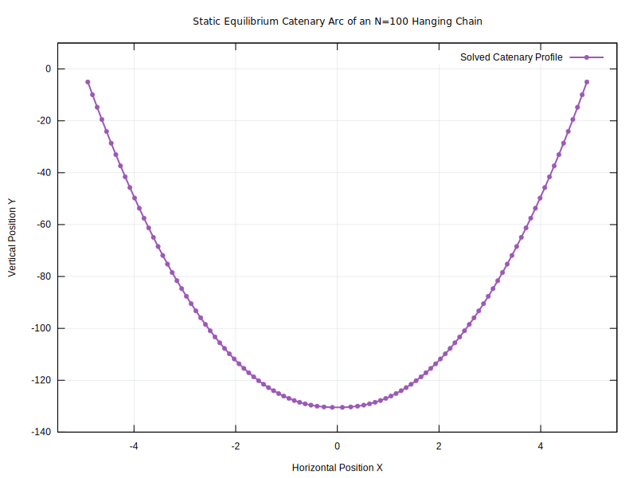

# Multi-Dimensional Non-Linear Root Finder
**Course:** Computational Methods for Physicists  
**Author:** Morten Nielsen  
**Project Task:** Implement Broyden's Method to solve non-linear equations in multi-dimensions.

---

## 1. Implementation

### 1.1 Algorithmic Framework
I reused the code from my multi-dimensional root-finding assignment due to its object-oriented nature. This modular architecture made it trivial to extend the framework by injecting two new update rule strategies: Good Broyden (GB) and Bad Broyden (BB). The core objective of implementing both variants was to systematically isolate and analyze their performance profiles, using the governing equations provided in the lecture notes.

Both variants achieve computational acceleration by applying a rank-1 algebraic update directly to the approximate inverse Jacobian matrix $B$. This bypasses the necessity of executing a computationally expensive $\mathcal{O}(N^3)$ QR decomposition/inversion loop at every iteration step. 

The Good Broyden method updates the matrix via:

$$\Delta B=\frac{\Delta x-B\Delta f}{\Delta x^TB\Delta f}\Delta x^TB$$

Conversely, the Bad Broyden method applies the following update formulation:

$$\Delta B=\frac{\Delta x-B\Delta f}{\Delta f^T\Delta f}\Delta f^T$$

By leveraging these cheap rank-1 corrections, Broyden's method requires evaluating a full finite-difference Jacobian exactly once at initialization ($i=0$). Under ideal, smooth conditions, subsequent updates drop the per-step time complexity from $\mathcal{O}(N^3)$ down to an agile $\mathcal{O}(N^2)$. 

### 1.2 Curvature Interpretation and the Quasi-Newton Secant Equation
The fundamental mathematical divergence between these two formulations lies in how they interpret directionality and surface curvature. Both methods are constrained by the **Quasi-Newton Secant Equation**, which demands that the matrix update honors the latest directional shift:
$$B_{k+1}\Delta f_k = \Delta x_k$$

Because this underdetermined system offers infinite valid matrix solutions, the algorithms choose different vector projection spaces to satisfy it:

* **Good Broyden (Direct Inverse Space):** GB minimizes the structural change to the inverse matrix along the step direction vector $\Delta x_k$. Geometrically, this means it explicitly preserves historical curvature information along the exact line the solver is traveling. It acts as an automatic preconditioner, allowing the matrix to adapt gracefully to anisotropic terrains (narrow valleys where directions vary widely in sensitivity).
* **Bad Broyden (Direct Derivative Space):** BB instead minimizes the matrix change along the residual force difference vector $\Delta f_k$. This means its structural adjustments are heavily dictated by the raw magnitude changes of the function outputs. If a system is poorly scaled—where one equation changes by thousands and another changes by fractions—the dominant function scale completely swamps the $\Delta f_k^T \Delta f_k$ denominator. This blinding effect ruins the update integrity for the smaller scales, explaining why BB typically exhibits poor convergence properties on complex, coupled systems.

### 1.3 Numerical Deflection Safeguards
To account for highly non-linear or flat regions where the line-search step size shrinks excessively, the solver incorporates an automated recovery routine. If the tracking parameter drops below the course-defined threshold ($\alpha < 1/128$), the code flags a potential loss of matrix accuracy, triggers a full finite-difference re-evaluation of the Jacobian, and executes a fresh QR decomposition. 

If the newly sampled matrix exhibits linearly dependent columns (numerical singularity), the engine safely traps the failure inside a `try-catch` block and defaults the tracking matrix to a scaled Identity matrix ($B = I$). This forces a pure gradient-descent escape step, steering the coordinates safely away from degenerate local extrema.

---

## 2. Testing 

### Test 1: Runtime Scaling & Function Evaluations
To evaluate the scalability of the routines against full Newton-Raphson benchmarks, a chained synthetic system was constructed capable of scaling to arbitrary dimensions ($N$):

$$f_i(x)=x_i^2-x_i \quad \text{for } i \in [1, 2, \dots, N-1]$$

$$f_N(x)=x_N^2-1$$

The execution windows were timed using the C++ standard `chrono` library. A linear-linear scale was selected over a log-log plot to avoid heavy visual compression at low dimensions and to keep the subtle tracking differences between the two Broyden methods legible.

The scaling chart clearly demonstrates that both Quasi-Newton variations significantly outpace Newton's method as dimensions swell. Interestingly, Good Broyden performs marginally slower than Bad Broyden here. This is an expected artifact of the system: because this trivial chained system converges in an identical number of iterations for both methods, GB's slightly more complex row-vector vector multiplications introduce a trace amount of algorithmic overhead.

However, monitoring the **total function evaluations** exposes the real computational savings. Both methods drastically reduce the total number of objective function calls compared to Newton, as they do not require repeating finite-difference column sweeps.

### Test 2: Convergence Mapping & Stability Basins
To rigorously stress-test the structural limits of the rank-1 updates, the routines were mapped across the non-linear intersection of a circle and a highly distorted sinusoidal wave:

$$f_1(x,y)=x^2+y^2-4=0, \quad f_2(x,y)=\sin(x+y^2)-0.5=0$$

A uniform grid of initial guesses $(X_0, Y_0) \in [-3, 3] \times [-3, 3]$ was mapped out. The color spectrum tracks the iteration count required to resolve the roots. The execution ceiling was locked at 100 steps; any trial resulting in divergence or stagnation was assigned a value of 120 to clearly isolate failure zones. Crucially, the automated Jacobian reset utility was completely deactivated for this run to observe how the unassisted rank-1 updates handle challenging terrains.

The Bad Broyden configuration displays extreme instability, featuring vast tracts of complete divergence and a highly fractured basin landscape where it requires maximum iteration thresholds to resolve simple tracks.

Conversely, the Good Broyden configuration demonstrates superior topological resilience. While localized pockets of failure remain, the overall basin profile is remarkably clean, and successful regions are resolved with highly efficient, low iteration counts. 

*Note: If the Jacobian reset parameter remained active for this 2D check, both methods would yield identical basins, because the trivial cost of recalculating a $2 \times 2$ matrix allows BB to constantly mask its mathematical update errors by hiding behind Newton-style resets.*

### Test 3: Line Search Trajectory Analysis on Rosenbrock Valley
Because Newton's method computes exact, instantaneous quadratic curvature at every step, the specific choices of a line-search modifier are secondary. For Quasi-Newton methods, however, the step controller directly dictating coordinate spacing plays a massive role in matrix update preservation.

To profile this behavior, the solver traced the narrow, parabolic channel of the Rosenbrock function using both rigid geometric Backtracking and Quadratic Interpolation line searches. While theory suggests that modeling local curvature quadratically should accelerate the path, the severe non-linear twisting of the Rosenbrock walls often forced steps into constraints that minimized real performance gaps, leading to highly matching trajectory routes.

### Test 4: High-Dimensional Physics Application — Static Catenary Equilibrium
A primary application of multi-dimensional root-finding in physics is resolving large-scale static equilibrium profiles. Here, the system solves for the geometric sag of a heavy spring-mass chain suspended under uniform gravity between fixed coordinates $(-5,0)$ and $(5,0)$. Specifying $N=100$ internal moving point masses expands the computational state space into a **200-dimensional coupled non-linear system**.

Static equilibrium dictates that the net force vector acting upon every discrete node $i$ must precisely balance to zero:

$$\vec{F}_{\text{net}, i} = \vec{F}_{\text{spring}, i} + \vec{F}_{\text{spring}, i+1} + \vec{F}_{\text{gravity}, i} = \mathbf{0}$$

This physical constraint translates directly into a system of $2N$ algebraic equations for the coordinates:

$$f_{x,i}=k\left(1-\frac{L}{r_{i-1,i}}\right)(x_i-x_{i-1})-k\left(1-\frac{L}{r_{i,i+1}}\right)(x_{i+1}-x_i)=0$$

$$f_{y,i}=k\left(1-\frac{L}{r_{i-1,i}}\right)(y_i-y_{i-1})-k\left(1-\frac{L}{r_{i,i+1}}\right)(y_{i+1}-y_i)-mg=0$$

Where $k=100$ represents the elastic spring constant, $L$ is the relaxed spring rest length, $r_{a,b}$ represents Euclidean distances from $a$ to $b$, and $mg$ is the gravitational down-pull ($m=1.0, g=9.81$).

The fully resolved system maps a physical catenary profile. With the newly integrated Jacobian recalculation mechanism active, the solver dynamically flushes stale matrix history whenever line search steps stall. This prevents information latency down the chain links and allows the 200-dimensional system to comfortably converge within the default limit of 100 iterations, driving the final terminal residual norm down to an exceptional numerical precision of $3.44 \cdot 10^{-8}$.

---

## 3. Final Remarks & Self-Evaluation

### 3.1 External Contributions
This project pipeline was augmented through deliberate collaboration with the large language model Google Gemini. The model served as an excellent assistant for debugging segmentation faults during vector allocation, optimizing automated `gnuplot` compilation scripts within the `Makefile`, and brainstorming project extensions. It was also utilized to correct grammar, spelling, and phrasing throughout this README; if you are interested in reviewing the original unedited text, please refer to `draft.md`.

### 3.2 Deliverable Summary & Project Score
The assignment successfully fulfills all technical objectives outlined in the course syllabus while expanding into a comprehensive comparative study. Core milestones achieved include:
* Full implementations of both Good and Bad Broyden rank-1 updating routines.
* Quantitative runtime complexity profiling against classic Newton-Raphson baselines.
* Topological stability analysis mapping local convergence basins across non-linear domains.
* High-dimensional verification scaling to a 200-dimensional system modeling physical static catenary curves.

Potential areas for future exploration include a deeper analysis of the interplay between line-search constraints and update health, as well as lower-level compiler profiling. However, micromanaging minor low-level cache misses was deemed outside the scope of evaluating the fundamental numerical linear algebra.

The structural interface design of this tool reflects my personal preference for strict object-oriented separation over flat procedural functions. While some may prefer a design similar to `scipy.optimize`, this architecture maximizes pipeline transparency. Reflecting on the scope and final analytical results, I assign this project a self-evaluation score of **9.5 / 10**.
